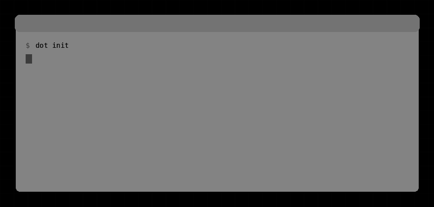
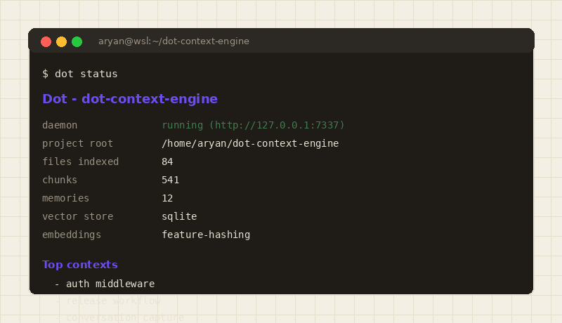
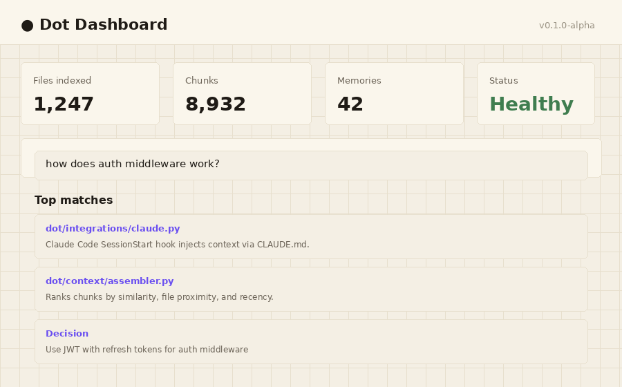
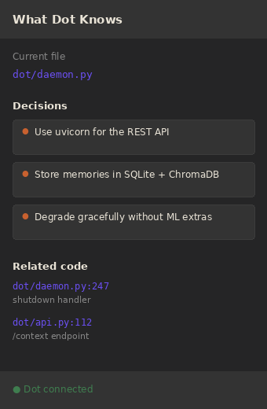

<p align="center">
  
</p>

<h1 align="center">Dot</h1>

<p align="center">
  <strong>A shared, local-first memory for your AI agents.</strong><br>
  One brain that every tool reads from and writes to, so you never re-explain your codebase again.
</p>

<p align="center">
  <a href="https://pypi.org/project/dot-context/"></a>
  <a href="https://github.com/Aryan-MP/dot-context-engine/releases"></a>
  <a href="https://marketplace.visualstudio.com/items?itemName=AryanMangod.dot-context-memory"></a>
  <a href="LICENSE"></a>
  <a href="https://github.com/Aryan-MP/dot-context-engine/actions/workflows/ci.yml"></a>
</p>

---

**Every agent you run is an amnesiac.**

You run Claude Code in one terminal, Cursor in another, Copilot in your editor, and none
of them remember anything. You explain your architecture to one, then again to the next,
then again in a fresh chat tomorrow. Every decision you made and every reason behind it is
gone the moment the session ends.

Dot is the memory they are missing. It runs quietly in the background as a local daemon,
builds a living understanding of your codebase and the decisions behind it, and serves
that memory to **any** agent through a local REST API: one brain that every tool reads
from and writes to. Think of it as a second brain for your agents, or a notebook that
remembers *why*, not just *what*.

**Local. Private. Model-agnostic. Open source.** No code leaves your machine - embeddings
are generated locally with sentence-transformers, storage is SQLite + ChromaDB on disk.

### Why a separate memory layer?

Your AI tools each have their own context window, and each one resets to zero. Dot sits
underneath all of them:

- **One memory, every agent.** Claude Code, Copilot, Cursor, a CI agent, a `curl` one-liner
  in a script - they all read the same context and write back to the same store.
- **It remembers across sessions.** Decisions captured from a chat last night are there
  this morning, for a *different* tool, without you re-explaining anything.
- **It remembers *why*.** Not just code, but the architectural decisions, the rejected
  alternatives, the "we chose X over Y because..." that normally lives only in your head.
- **A forgetting curve keeps it sharp.** Memories decay with age but are reinforced every
  time they are used, so what stays relevant survives and stale noise fades: spaced
  repetition for your codebase.

## Install

Requires **Python 3.11+**. Everything runs locally - no account, no API key, no cloud.

```bash
pip install "dot-context[ml]"      # recommended: with local embeddings
dot --version
```

Or the light build (no ML stack - uses a deterministic hashing embedder instead):

```bash
pip install dot-context
```

For development, clone and install in editable mode:

```bash
git clone https://github.com/Aryan-MP/dot-context-engine.git
cd dot-context-engine && pip install -e ".[dev]"
```

## How it works

Three layers make up the brain:

- **dot-memory** is the long-term memory. It mines architectural decisions from commit
  messages and AI conversations, stores them with a forgetting curve (stale memories decay,
  frequently used ones are reinforced), and lets any agent write new decisions back via the
  API. This is the part that makes Dot a *second brain* and not just a search index.
- **dot-indexer** is the working memory of your code. It chunks code by function/class
  (not fixed token windows), extracts docstrings, imports, and TODO/`decided to…` comments,
  and embeds everything locally.
- **dot-context** is recall. It assembles context ranked by semantic similarity, file
  proximity, recency, and edit frequency, fills a token budget greedily, and formats it for
  whichever agent is asking (Claude XML, concise Copilot, markdown, or raw JSON).

## Quick start

```bash
cd your-project
dot init                          # index the project, wire up git + Claude Code hooks
dot daemon start                  # keep watching in the background

dot ask "how does auth middleware work?"
dot inject "refactoring the billing module" --fmt claude | pbcopy
dot status
dot dashboard                     # web UI at http://localhost:7337/ui
```

## Your first 5 minutes

A quick health check before you wire Dot into every tool. From your project root:

```bash
dot init && dot daemon start
dot status                         # expect: files indexed > 0, daemon running
dot ask "where is X handled?"      # real files, even without exact keywords
dot memory add "Chose JWT over sessions for the stateless API"
dot memory list                    # your decision is captured
```

If `dot ask` returns the right files and `dot memory list` shows your decision,
the core loop works. Now prove the *shared* part below.

## One brain, every agent

The point of Dot is that what *one* agent learns, *every* agent knows. Teach it once:

```bash
# Monday - while pairing with Claude Code, you record a decision:
curl -X POST http://127.0.0.1:7337/memory -H 'content-type: application/json' \
  -d '{"content": "Chose Postgres advisory locks over Redis for job dedup, one less service to run", "kind": "decision"}'
```

```bash
# Tuesday - a different tool, a fresh session, asks the same question:
curl 'http://127.0.0.1:7337/context?query=how%20do%20we%20dedup%20jobs&fmt=raw'
# surfaces the advisory-locks decision, the reasoning, and the code around it.
```

No re-explaining. No copy-pasting context between tools. The memory outlives the session
and crosses the tool boundary, which is the whole idea.

## See it in action



| `dot status` | `dot dashboard` | VS Code extension |
|---|---|---|
|  |  |  |


Full walkthrough with experiments (terminal + VS Code): [docs/getting-started.md](docs/getting-started.md)  
Deep technical internals: [docs/internals.md](docs/internals.md)  
Prerequisites from zero: [docs/foundations.md](docs/foundations.md)

## CLI

| command | what it does |
|---|---|
| `dot init` | initialize Dot in a project (+ git hook, CLAUDE.md, Claude Code hook) |
| `dot status` | what Dot knows about the current project |
| `dot ask "…"` | query your codebase in natural language |
| `dot inject [query]` | print assembled context - pipe it anywhere |
| `dot memory list/add/export/delete` | browse and manage captured decisions |
| `dot sync` | force re-index |
| `dot forget "pattern"` | remove memories matching a pattern |
| `dot dashboard` | open the web UI |
| `dot daemon run/start/stop/install-service` | control the daemon (launchd/systemd) |

## REST API (localhost:7337)

```
GET  /status                 daemon health + project stats
GET  /context?query=&file=&fmt=claude|copilot|markdown|raw
POST /memory                 capture a decision        GET /memory   browse
POST /memory/conversation    extract decisions from an AI transcript
DELETE /memory/{id}          forget
GET  /graph                  dependency graph JSON
POST /ask                    natural-language codebase query
POST /sync                   force re-index
```

## Integrations

Every integration is just another agent plugging into the same brain: read context, write
decisions back.

- **Claude Code** - `dot init` adds a CLAUDE.md section and a SessionStart hook that
  injects context at the start of every session.
- **VS Code / Copilot** - install [Dot - AI Context Memory](https://marketplace.visualstudio.com/items?itemName=AryanMangod.dot-context-memory)
  from the VS Code Marketplace. It shows "what Dot knows about this file" in a sidebar,
  registers Dot as a Language Model tool for Copilot Chat (`#dotContext`), and offers
  one-click decision capture.
- **Anything else** - `curl localhost:7337/context?query=...&fmt=raw`.

## Development

```bash
make install     # editable install with dev extras
make test        # pytest
make lint        # ruff
make dashboard   # build the web UI into dashboard/dist (served at /ui)
make extension   # compile the VS Code extension
```

The ML stack (`chromadb`, `sentence-transformers`) and tree-sitter are **optional
extras** - without them Dot degrades to a deterministic hashing embedder, SQLite
brute-force vector search, and heuristic parsing, so the full pipeline still works
(and tests run) on any machine.

See [docs/getting-started.md](docs/getting-started.md) for the full
walkthrough and test experiments, [docs/internals.md](docs/internals.md)
for the complete technical deep dive (architecture, algorithms, math, and
trade-offs), and [docs/integrations.md](docs/integrations.md) for tool wiring.

## Contributing

We welcome bug reports, feature ideas, and pull requests. See
[CONTRIBUTING.md](CONTRIBUTING.md) for guidelines.

## License

MIT
